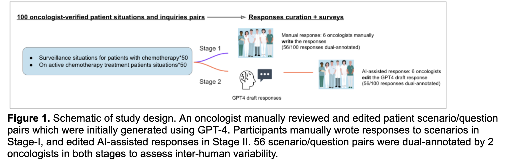
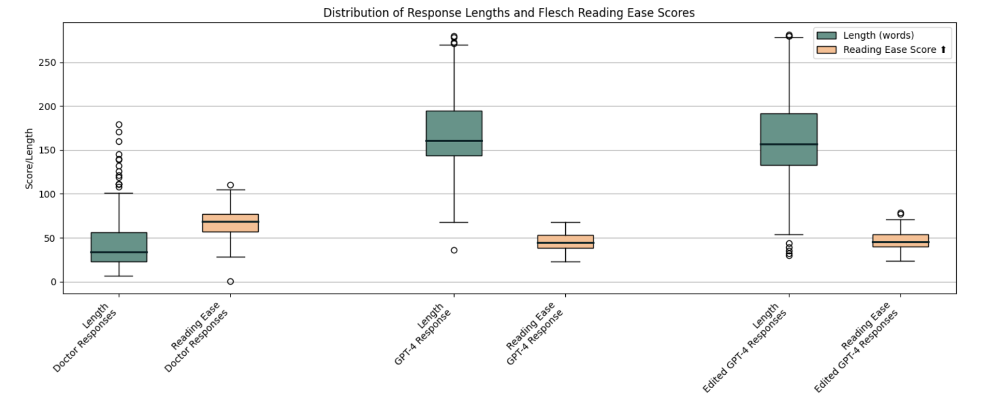
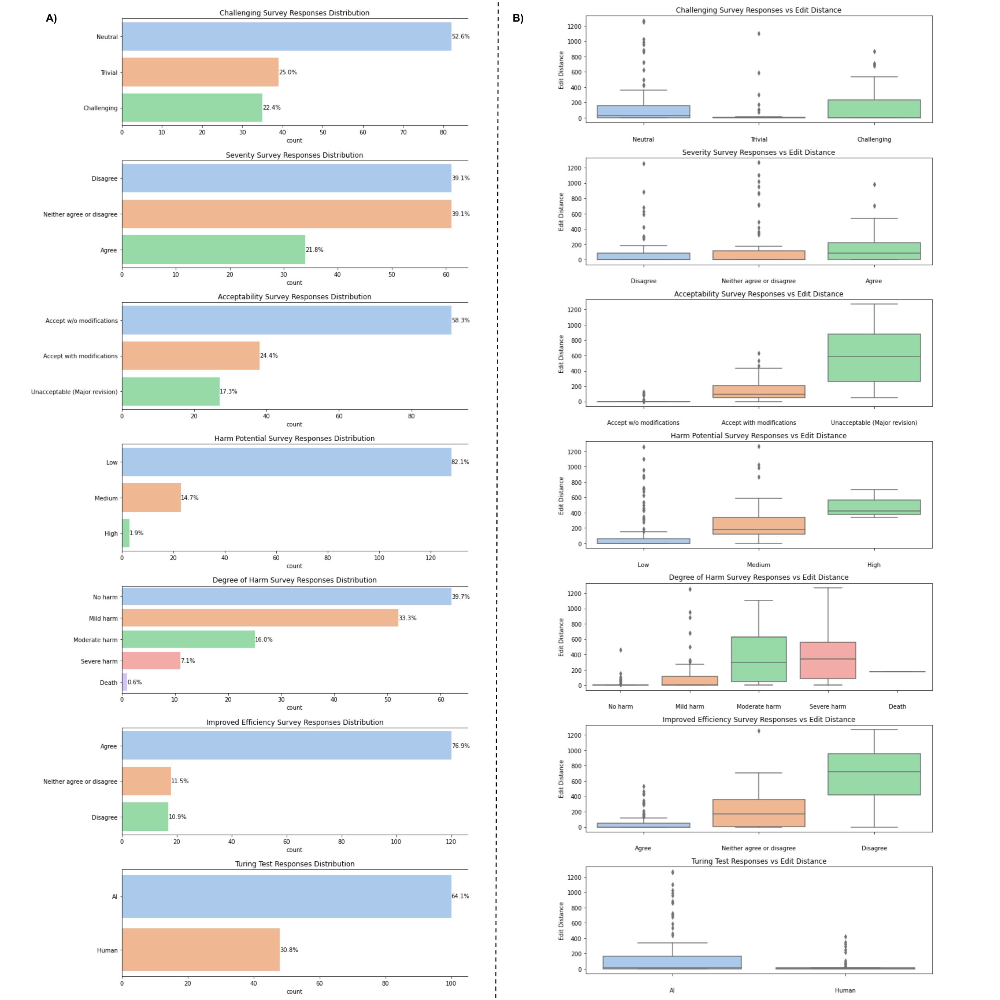
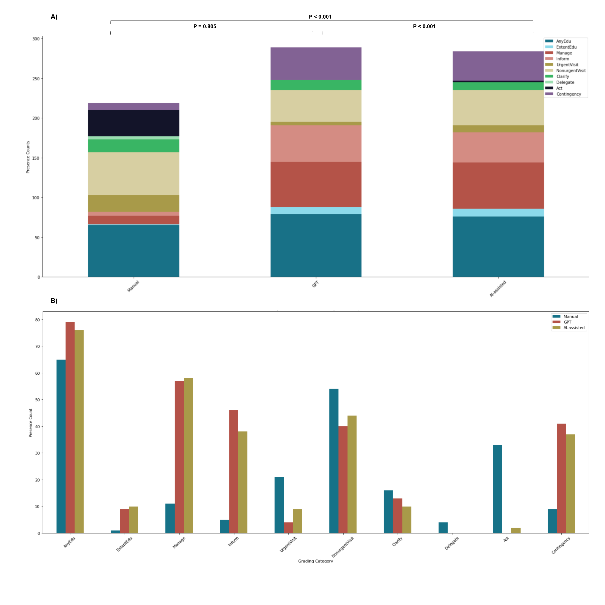

## OncQA: The effect of using a large language model to respond to patient messages

### Importance

Documentation burden is a major factor contributing to clinician burnout, which is increasing across the country and threatens our capacity to provide patient care in the U.S. While AI chatbots show potential in reducing this burden by aiding in documentation and are being incorporated into electronic health record systems, their influence on clinical decision-making remains understudied for this purpose.

### Objective

Investigate the acceptability, safety, and potential human factors issues when utilizing an AI-powered chatbot to draft responses to patients' inquiries.

### Design

- A 2-stage cross-sectional study was designed around 100 synthetic cancer patient scenarios couples with patient messages.
- These questions emulate realistic oncology scenarios.
- **Stage 1: Manual Reponse**: Six oncologists were randomly allocated 26 questions for response.
- **Stage 2: AI-Assisted Response**: The same oncologists received 26 new questions, alongside GPT-4 generated responses for editing.
- Informed consent was obtained.
- Participants were blinded to the source of the drafts.
- Surveys were undertaken for every scenario/response.
  

### Settings

This research was conducted at the Brigham and Women’s Hospital, Boston, MA in 2023.

### Participants

Six board-certified oncologists participated.

### Intervention

Employment of GPT-4, an AI chatbot, for drafting responses to patient inquiries.

### Main Outcomes & Measures

- Evaluate the impact and utility of an AI chatbot in assisting responses to patient messages.
- Impact was determined by comparing response length and readability, using the Flesch reading ease score, and content.
- Utility was ascertained through physician feedback on surveys regarding acceptability, potential harm, and efficiency of chatbot-crafted drafts.

### Results

- On average, manual responses were more concise than those by GPT-4 or AI-assisted (34 vs. 169 vs. 160 words, p<0.001).
- Manual responses were more readable than GPT-4 or AI-assisted messages (Flesch score 67 vs. 45 vs. 46, p<0.001).
  
- About 58% of GPT-4 drafts were immediately acceptable, with 82% posing a low risk of harm.
- Utilizing the GPT-4 draft enhanced documentation efficiency in 77% of replies.
- Surprisingly, 31% of GPT-4 responses were perceived to be human-written, despite being AI-generated.
- 7.7% of survey responses felt unedited GPT-4 drafts could lead to severe harm or death.
  
- Among 56 dual-annotated responses, annotation agreement was low for manual responses (Cohen's kappa 0.10), but improved for AI-assisted responses (Cohen's kappa 0.52).
- AI-assistance led to differences in clinical content in the responses (p=0.001).
- Manual replies were more likely to advise direct clinical actions, while GPT-4 drafts often provided educational and self-management suggestions.
- AI-aided replies closely mirrored GPT-4 drafts but introduced some direct clinical actions.
  

### Conclusions & Relevance

AI-generated chatbot responses, while lengthier and less accessible, were overall safe and improved efficiency. AI-assistance altered the nature of physician feedback and reduced variability. AI chatbots are a promising avenue to address physician burnout and could improve patient care, however interactions between humans and AI might affect clinical decisions in unexpected ways. Addressing these interactions is vital for the safe incorporation of such technologies.

**Note**: It's imperative to delve deeper into human-AI interactions and their potential impact on outcomes.

### About this repo

- `Data/content_grading` contains all of the content grading done by physician DSB. 56 is the dual annotated ones while 44 were the single annotated ones.
- `Data/original_questions_gpt4_outputs` contains all the patient scenarios and gpt4 raw responses.
- `Data/parsed_data` contains all the stage1 and stage2 parsed data.
- `Data/stage1_responses` were the physicians raw responses in docx.
- `Data/stage2_responses` were the physicians raw responses in docx.

# Citation:
```
@misc{chen2023impact,
title={The effect of using a large language model to respond to patient messages},
author={Shan Chen and Marco Guevara and Shalini Moningi and Frank Hoebers and Hesham Elhalawani and Benjamin H. Kann and Fallon E. Chipidza and Jonathan Leeman and Hugo J. W. L. Aerts and Timothy Miller and Guergana K. Savova and Raymond H. Mak and Maryam Lustberg and Majid Afshar and Danielle S. Bitterman},
year={2023},
eprint={2310.17703},
archivePrefix={arXiv},
primaryClass={cs.CL}
}
```


