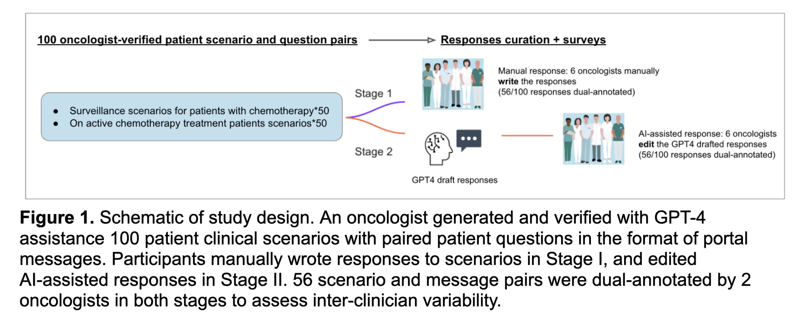

## OncQA: The Impact of Using an AI Chatbot to Respond to Patient Questions

### Importance

Documentation burden is a major factor contributing to clinician burnout, which is increasing across the country and threatens our capacity to provide patient care in the U.S. While AI chatbots show potential in reducing this burden by aiding in documentation and are being incorporated into electronic health record systems, their influence on clinical decision-making remains understudied for this purpose.

### Objective

Investigate the acceptability, safety, and potential human factors issues when utilizing an AI-powered chatbot to draft responses to patients' inquiries.

### Design

- A cohort study was designed around 100 synthetic cancer patient situations coupled with patient queries.
- These questions emulate realistic oncology scenarios.
- **Stage 1**: Six oncologists were randomly allocated 26 questions for response.
- **Stage 2**: The same oncologists received 26 new questions, alongside GPT-4 generated responses for editing.
- The origin of the drafts was concealed from the participants.
- Surveys were undertaken for every MD involved query.

### Settings

This research was conducted at the Brigham and Women’s Hospital, Boston, MA in 2023.

### Participants

Six board-certified oncologists participated.

### Intervention

Employment of GPT-4, an AI chatbot, for drafting responses to patient inquiries.

### Main Outcomes & Measures

- Evaluate the impact and utility of an AI chatbot in assisting responses to patient messages.
- The influence was determined by comparing response length and readability, using the Flesch reading ease score, and content.
- Utility was ascertained through physician feedback on surveys regarding acceptability, potential harm, and efficiency of chatbot-crafted drafts.

### Results

- On average, physician responses were more concise than those by GPT-4 or AI-assisted (34 vs. 169 vs. 160 words, p<0.001).
- Physician drafts were typically more comprehensible than GPT-4 or AI-assisted messages (Flesch score 67 vs. 45 vs. 46, p<0.001).

- About 58% of GPT-4 crafted replies were immediately acceptable, with 82% posing a low risk of harm.
- Utilizing the GPT-4 draft enhanced documentation efficiency in 77% of replies.
- Surprisingly, 31% of GPT-4 responses were perceived to be human-written, despite being AI-generated.

- Annotation agreement exhibited a low score of 0.10 between two doctor groups, whereas edited versions displayed 0.52.
- AI involvement led to divergent clinical content in the responses (p=0.001).
- Manual replies were more inclined to advise direct clinical actions, while GPT-4 drafts often provided educational and self-management suggestions.
- AI-aided replies closely mirrored GPT-4 drafts but introduced some direct clinical actions.

### Conclusions & Relevance

AI-generated chatbot responses, while lengthier and less accessible, maintained safety standards and amplified documentation efficiency. AI intervention altered the nature of physician feedback and minimized variability. While AI chatbots offer solutions to physician burnout and can enhance patient care, interactions between humans and AI might inadvertently affect clinical decisions. Addressing these interactions is vital for the safe incorporation of such technologies.

**Note**: It's imperative to delve deeper into human-AI interactions and their potential impact on outcomes.

<!-- # Citation:
  `OncQA: The Impact of Using an AI Chatbot to Respond to Patient Questions
Shan Chen, Benjamin H Kann, Michael B Foote, Hugo JWL Aerts, Guergana K Savova, Raymond H Mak, Danielle S Bitterman
JAMA Oncology. Published online August 24, 2023. doi:10.1001/jamaoncol.2023.2954` -->
